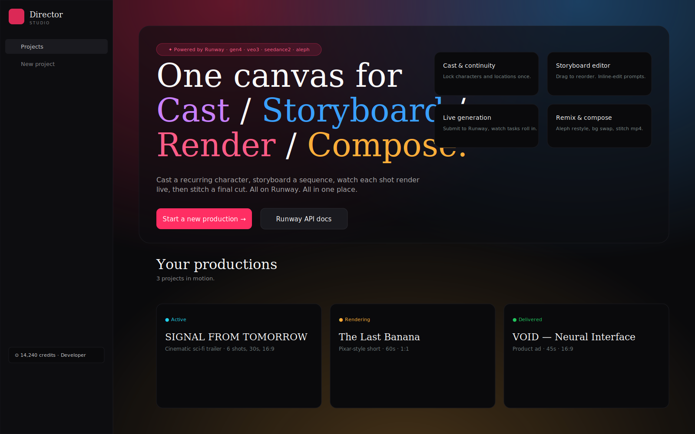
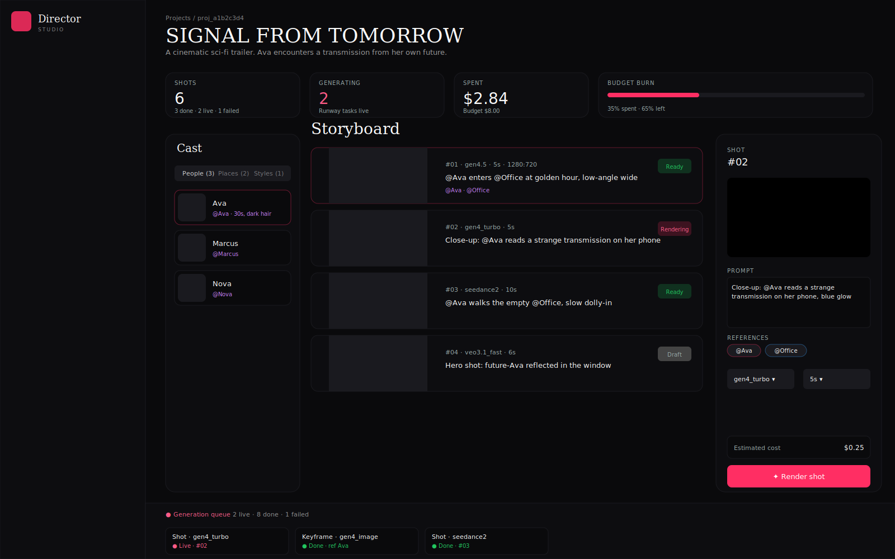
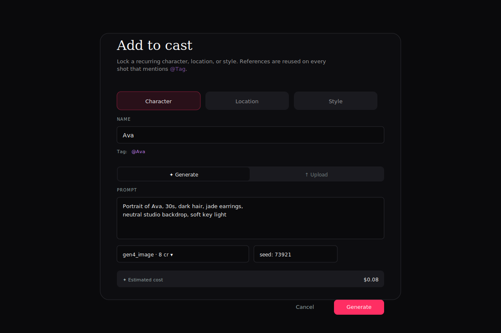
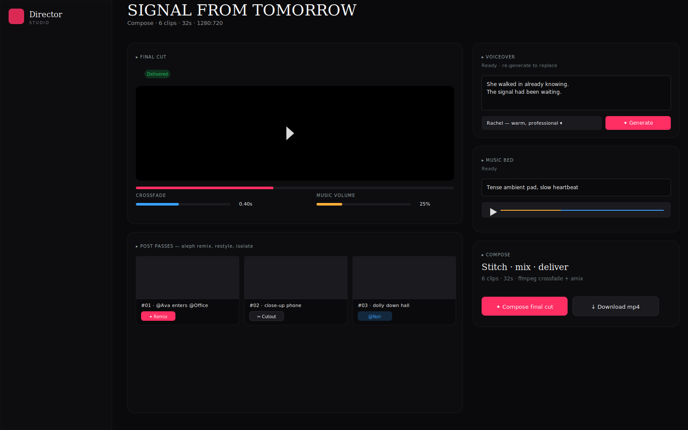

<div align="center">


# Director Studio

**Hyperintelligent video production. One canvas for** _cast_ · _storyboard_ · _render_ · _compose_ — **powered by [Runway](https://dev.runwayml.com/).**

[](https://nextjs.org)
[](https://www.typescriptlang.org/)
[](https://tailwindcss.com)
[](https://docs.dev.runwayml.com/api/)
[](LICENSE)
[](#)

[**Quick start**](#-quick-start) ·
[**What it does**](#-what-it-does) ·
[**Screens**](#-screens) ·
[**FAQ**](#-faq) ·
[**Roadmap**](#-roadmap)

</div>

---

> Cast a recurring character, storyboard a sequence, watch each shot render live, then stitch a final cut with voiceover and music. **All on Runway. All in one place.**

Director Studio is a local-first Next.js 15 app that turns Runway's API into a complete video production studio — the kind of canvas you'd expect from a $50/mo SaaS, running on your machine with your API key. It unifies the work of four open-source projects into a single interface:

- [`calesthio/OpenMontage`](https://github.com/calesthio/OpenMontage) — the agentic production pipeline.
- [`runwayml/skills`](https://github.com/runwayml/skills) — the Runway API surface.
- [`video-db/Director`](https://github.com/video-db/Director) — the video agent framework.
- [`HKUDS/ViMax`](https://github.com/HKUDS/ViMax) — the consistency-first generation philosophy.

## 🎬 What it does

| You want to… | Director Studio gives you… |
| --- | --- |
| Generate a clip that looks like every other AI video | _no — there are 50 of those_ |
| Generate a **multi-shot piece where the same character appears in every shot** | ✅ Cast registry — lock a reference once, every prompt that mentions `@Tag` reuses that identity |
| Storyboard a sequence and see cost **before** you spend | ✅ Storyboard editor — drag-reorder, inline-edit, per-shot price tag |
| Submit a batch and watch progress without refreshing | ✅ Live render queue — every Runway task streams its state into the bottom dock |
| Restyle a shot, swap its background, or isolate the subject | ✅ Aleph remix / cutout / restyle from any rendered clip |
| Add voiceover and a music bed | ✅ Eleven multilingual TTS + sound-effect music, mixed with ffmpeg |
| Export a final mp4 | ✅ One click — crossfaded, mixed, libx264, ready to upload |

## 🚀 Quick start

> **You'll need:** [Node 18+](https://nodejs.org), [pnpm](https://pnpm.io/installation) (or npm/yarn), [ffmpeg](https://ffmpeg.org/download.html), and a [Runway developer key](https://dev.runwayml.com/) with at least $10 of prepaid credits.

```bash
# 1. Clone
git clone https://github.com/RhythrosaLabs/director-studio.git
cd director-studio

# 2. Install
pnpm install        # or: npm install / yarn / bun install

# 3. Configure
cp .env.example .env
# open .env and paste your RUNWAYML_API_SECRET

# 4. Run
pnpm dev
# → http://localhost:8888
```

That's it. No accounts, no cloud, no telemetry. Your projects, references, and rendered media live in `./data/`. Wipe that directory to reset everything.

### First-timer? Here's a 5-minute starter

1. **Open** `http://localhost:8888` and click **New project**.
2. Pick a preset (Cinematic short / Social vertical / Product film / Music video) — they prefill the aspect ratio and budget.
3. In the Director view, click **Add** in the Cast panel. Generate one reference image for your protagonist (`gen4_image`, ~$0.08).
4. Click **Add shot**. Write a prompt that mentions your reference with the `@` prefix — for example `"@Ava walks into the office at golden hour"`. Toggle her chip on so the shot knows to use the reference.
5. Hit **Render shot**. Watch the task land in the bottom dock; the clip appears inline when it finishes (~60–120s).
6. Repeat for a few more shots. Open the **Compose** tab when you're ready.
7. Type a voiceover line, pick a voice, generate. Type a music prompt, generate. Hit **Compose final cut**. Download the mp4.

You just made a film. Total cost for a typical 30-second piece: **$2–$5**.

## 📸 Screens

<div align="center">

| Landing | Director |
| :-: | :-: |
|  |  |
| _Hero, project list, budget burn at a glance._ | _Cast (left) · drag-reorder storyboard (centre) · shot editor (right) · live queue (bottom)._ |
| **Cast** | **Compose** |
|  |  |
| _Generate or upload a locked reference; mention `@Tag` in any prompt._ | _Voiceover, music, crossfade, per-shot aleph passes, one-click final mp4._ |

</div>

> The screenshots above are SVG product shots. Once you run the app, swap them for real PNGs from your screen — `pnpm screenshots` (see [`scripts/capture.mjs`](./scripts/capture.mjs)) automates this with Playwright.

## 📹 Video tutorial

A walkthrough video is planned for the v0.1 release. If you'd like to record one — or just see one — open an issue and we'll prioritise it. The five-minute starter above is the script; total cost to demo is under $5 of Runway credit.

## 🧠 Why it's smart

Three design choices that compound:

1. **References are first-class.** Adding a character isn't "uploading an image." It's registering a tag (`@Ava`) that future prompts compose into. Every shot that names a tag automatically generates a keyframe with that reference, then animates it via image-to-video. This is the technique that actually keeps faces consistent across cuts.
2. **The pipeline is honest.** Every paid call announces its cost _before_ submission. Every shot exposes its model, seed, and reference set so regeneration is deterministic. Failed shots can be retried in place with a seed bump.
3. **The compose stage is one step, not a project.** Once shots exist, voiceover + music + crossfade + stitch all live on one page, and the final mp4 is one click.

## 🧰 Capabilities surface

| Operation | Runway model | Where it lives |
| --- | --- | --- |
| Text-to-image (with reference tags) | `gen4_image`, `gen4_image_turbo`, `gemini_2.5_flash` | Cast registry, keyframe step |
| Text-to-video | `gen4.5`, `veo3`, `veo3.1`, `veo3.1_fast` | Shot render (no references) |
| Image-to-video | `gen4_turbo`, `gen4.5`, `seedance2`, `veo3.x` | Shot render (with keyframe) |
| Long-duration video (up to 15s) | `seedance2` | Shot render when duration > 10s |
| Video-to-video remix | `gen4_aleph` | Compose → Post passes |
| Background isolate / replace | `gen4_aleph` (cutout prompt) | Compose → Cutout |
| Text-to-speech | `eleven_multilingual_v2` | Compose → Voiceover |
| Sound design / music bed | `eleven_text_to_sound_v2` | Compose → Music |
| Voice dubbing | `eleven_voice_dubbing` | Available via API (`POST /api/runway/...`) |
| Final mp4 stitch + mix | `ffmpeg` | Compose → Compose final cut |

## 🏗️ Architecture

```
src/
├── app/                       Next.js routes
│   ├── page.tsx               Landing — hero + project grid
│   ├── projects/new/          Create flow with 4 presets
│   ├── projects/[id]/         Director · Assets · Compose
│   └── api/                   Read-only JSON for live polling
├── components/
│   ├── ui/                    shadcn primitives (16 components)
│   ├── shell/                 AppShell, sidebar, command palette
│   ├── cast/                  Cast panel + add-reference dialog
│   ├── storyboard/            Drag-reorder timeline + shot editor
│   ├── queue/                 Live task queue dock
│   └── compose/               Final cut + voiceover + music + remix
└── lib/
    ├── runway/                TS Runway client (port of OpenMontage)
    ├── db/                    SQLite + Drizzle schema + queries
    ├── actions/               Server actions (projects, cast, shots, generation, composition)
    └── hooks/                 useTimeline (auto-polling)
```

| Layer | Choice | Why |
| --- | --- | --- |
| Framework | Next.js 15 (App Router, Server Actions, Turbopack) | Single binary, server-side calls keep keys off the client |
| UI | Tailwind v3 + shadcn/ui (Radix) + Framer Motion | Aesthetic-by-default primitives, animation that doesn't feel like motion-for-motion's-sake |
| State | RSC + RQ-style polling (`/api/projects/[id]/timeline`) | Real-time-enough without a websocket layer |
| Database | SQLite via `better-sqlite3` + Drizzle ORM | Single file, embedded, zero ops |
| Generation | Runway dev API (TS client) | `lib/runway/client.ts` is a 1:1 port of OpenMontage's Python client |
| Composition | ffmpeg (`concat` demuxer for fast, `xfade` + `amix` for fancy) | Already on most systems |

## ⌨️ Keyboard

| Shortcut | Action |
| --- | --- |
| `⌘ K` / `Ctrl K` | Command palette |
| `N` | New project |
| `Esc` | Close any dialog |

## 🧪 Requirements

| | Version | Notes |
| --- | --- | --- |
| Node.js | 18.17+ (22 recommended) | `better-sqlite3` builds against your runtime, so use the same Node for install and dev. |
| pnpm | 9+ | npm and yarn also work; pnpm is faster and the lockfile is checked in. |
| ffmpeg | any recent | Required for the final stitch step. macOS: `brew install ffmpeg`. Debian/Ubuntu: `apt-get install ffmpeg`. Windows: [gyan.dev builds](https://www.gyan.dev/ffmpeg/builds/). |
| Disk | ~500MB + your media | Generated clips land in `data/assets/`. A 30-second 720p production is ~30MB. |
| Network | Outbound to `api.dev.runwayml.com` | The app makes server-side calls only. Your key never reaches the browser. |
| Runway credits | $10 minimum top-up | Typical productions run $1–$8 each. |

## 🔐 Security & privacy

- **Local-first.** Your projects, prompts, and rendered media live in `./data/` on the machine you run this on. Nothing is uploaded to a Director Studio cloud — there is no Director Studio cloud.
- **Server-side only.** Your `RUNWAYML_API_SECRET` is read by the Next.js server runtime. It is never exposed to a client component.
- **Host allowlist.** Set `RUNWAY_ALLOWED_MEDIA_HOSTS=…` to lock which external URLs the app will hand to Runway. Recommended for production deploys.
- **Path traversal hardening.** The asset serving route (`/api/assets/[id]?path=…`) confines reads to a single project's directory.

## 🛠️ Configuration

`.env` (copy from `.env.example`):

```env
RUNWAYML_API_SECRET=         # required — https://dev.runwayml.com/
# RUNWAY_ALLOWED_MEDIA_HOSTS=storage.googleapis.com,cdn.example.com
DATABASE_URL=./data/director.db
ASSETS_DIR=./data/assets
```

Project budget, aspect ratio, model defaults, and crossfade are all per-project — set them when you create the project, or change them inline.

## ❓ FAQ

<details>
<summary><b>Do I need any keys other than Runway?</b></summary>

No. The voiceover, music, and dubbing endpoints are accessed through Runway, which proxies to ElevenLabs models. One key covers all of it.
</details>

<details>
<summary><b>Why isn't this just a fork of OpenMontage?</b></summary>

OpenMontage is an agent-driven Python pipeline — phenomenal under the hood, but you talk to it through an AI assistant. Director Studio is the same intelligence wrapped in direct-manipulation UI: drag a shot, click render, watch it land. The TS client in `src/lib/runway/` is a faithful port of OpenMontage's Python client, so changes flow both ways.
</details>

<details>
<summary><b>Can I use a different video model?</b></summary>

Every model Runway exposes is selectable per shot — gen4.5 by default, swap to seedance2 for long takes, veo3.x for premium, gen4_turbo for cheap image-driven work. The cost meter updates live as you change models.
</details>

<details>
<summary><b>What about consistency across more than 10 shots?</b></summary>

The reference system uses Runway's `referenceImages` tagging, which is excellent for 5–10 shots and drifts slowly beyond that. Director Studio's recommended workflow for longer pieces is to re-anchor every few shots by regenerating a fresh keyframe from the original reference rather than from the previous keyframe. The shot editor has a one-click **Keyframe** button for this.
</details>

<details>
<summary><b>Is there a hosted version?</b></summary>

Not yet. The local-first design is intentional — your prompts and references stay on your machine, and Runway bills your key directly. If there's interest in a hosted multi-user version, open a discussion.
</details>

<details>
<summary><b>Can I export the storyboard as JSON?</b></summary>

Yes — the project's `manifest.json` (written on every compose run, available under `data/assets/<project_id>/`) captures every shot, model, seed, reference, and the final mp4 path. Hand it to OpenMontage's `runway-suite` pipeline to re-render the same production headlessly.
</details>

<details>
<summary><b>How do I get good at prompting Runway?</b></summary>

Three tips that move the needle more than any prompt template:
1. **Mention your tags with `@`.** `"@Ava enters @Office"` beats `"Ava enters the office"` every time.
2. **Lock seeds early.** Once a keyframe looks right, the seed becomes load-bearing.
3. **Edit the keyframe, not the clip.** If a shot drifts, regenerate the keyframe (~$0.08) before regenerating the clip ($0.50+).
</details>

## 🗺️ Roadmap

- [ ] Real PNG screenshots and a tutorial GIF (see `scripts/capture.mjs`).
- [ ] Project export/import (zip with manifest + assets).
- [ ] Multi-language dub from the Compose page (the API is already wired).
- [ ] Storyboard from a script — paste a screenplay, get shots.
- [ ] Hosted demo at `studio.rhythrosalabs.dev`.
- [ ] In-app cost forecasting before render-all.

## 🤝 Contributing

Director Studio is open to contributions of any size. See [`CONTRIBUTING.md`](./CONTRIBUTING.md) for the development setup, code style, and how to wire in a new Runway endpoint. The fastest way to help right now: report any rough edge you hit on first run as a GitHub issue — first-time friction is the #1 thing we want to file down.

## 🏷️ Topics

`runway` · `runway-api` · `video-generation` · `ai-video` · `gen4` · `veo3` · `seedance` · `aleph` · `nextjs` · `tailwindcss` · `shadcn-ui` · `framer-motion` · `sqlite` · `local-first` · `creative-tools` · `agentic-video` · `storyboard` · `film-tools`

## 📄 License

MIT — see [LICENSE](./LICENSE). Pulls in dependencies under MIT/ISC/Apache-2.0; see `package.json`.

## 🙏 Credits

Director Studio stands on the work of:

- [Runway](https://runwayml.com) — the API that makes any of this possible.
- [OpenMontage](https://github.com/calesthio/OpenMontage) by Calesthio AI Labs — the production pipeline this app is a UI for.
- [`runwayml/skills`](https://github.com/runwayml/skills) — the canonical Runway API surface.
- [`video-db/Director`](https://github.com/video-db/Director) — the video agent framework.
- [`HKUDS/ViMax`](https://github.com/HKUDS/ViMax) — the consistency-first generation philosophy.

Made with care by [Rhythrosa Labs](https://github.com/RhythrosaLabs).
